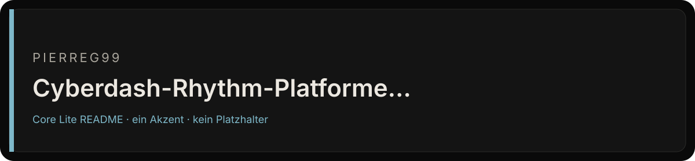
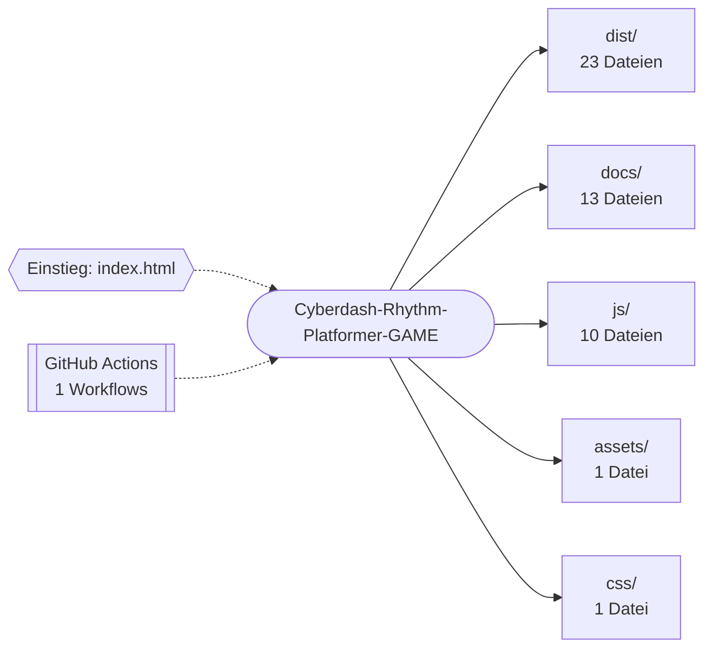

<div align="center">



# CYBER DASH — Neon Rhythm Platformer

<p><strong>CYBER DASH: Neon-Rhythmus-Plattformer mit 16 Levels, Editor und Audio-Engine.</strong></p>
<p>


</p>
<p>
<a href="https://github.com/Pierreg99/Cyberdash-Rhythm-Platformer-GAME/actions/workflows/deploy.yml"></a>
</p>
<p><a href="#schnellstart">Schnellstart</a> · <a href="#projektstruktur">Projektstruktur</a> · <a href="#english-summary">English</a></p>
</div>

<table>
<tr>
<td width="58%" valign="top">

### Bestand

CYBER DASH — Neon rhythm platformer with 16 levels, CRYO ice sector, full editor, and kinetic audio engine

Der Default-Branch `master` ist die Fläche, die zählt. Was nicht in diesem Baum liegt, ist kein Feature dieses Repos.

</td>
<td width="42%" valign="top">

### Fakten

| Feld | Wert |
| --- | --- |
| Owner | Pierreg99 |
| Branch | `master` |
| Sichtbarkeit | öffentlich |
| Sprache | JavaScript |
| Archiv | nein |

</td>
</tr>
</table>

---

## Inhaltsverzeichnis

- [Bestand und Fakten](#bestand)
- [Überblick](#überblick)
- [Features](#features)
- [Schnellstart](#schnellstart)
- [Architektur](#architektur)
- [Projektstruktur](#projektstruktur)
- [Dokumentation](#dokumentation)
- [Projektdetails](#projektdetails)
- [English summary](#english-summary)
- [Lizenzhinweis](#lizenzhinweis)

## Überblick

CYBER DASH: Neon-Rhythmus-Plattformer mit 16 Levels, Editor und Audio-Engine.

| Merkmal | Wert |
| --- | --- |
| Sprachen | JavaScript (78%), HTML (16%), CSS (6%) |
| Dateien im Repository | 65 |
| Einstiegspunkte | `index.html`, `server.js` |
| Version (`package.json`) | 2.0.3 |
| CI-Workflows | 1 |
| Lizenz | [LICENSE](LICENSE) |

## Features

- Canvas-2D-Rendering
- Klangerzeugung über die Web Audio API
- Lokale Speicherung im Browser (localStorage)
- Touch- und Pointer-Steuerung
- Echtzeit-Render-Schleife (requestAnimationFrame)
- Automatisierung über GitHub Actions: `deploy.yml`
- Veröffentlichung über GitHub Pages
- 15 Markdown-Dokumente

## Schnellstart

```bash
git clone https://github.com/Pierreg99/Cyberdash-Rhythm-Platformer-GAME.git
cd Cyberdash-Rhythm-Platformer-GAME
```

**Node.js**

```bash
npm install
npm run dev
npm start
npm run build
npm run test
```

<details>
<summary>Alle Skripte aus <code>package.json</code></summary>

| Skript | Befehl |
| --- | --- |
| `start` | `node server.js` |
| `dev` | `node server.js` |
| `build` | `node build.js` |
| `test` | `node --eval "console.log('All modules valid!')"` |

</details>

## Architektur

Übersicht der wichtigsten Verzeichnisse nach Anzahl der enthaltenen Dateien.



## Projektstruktur

```text
Cyberdash-Rhythm-Platformer-GAME/
├── .github/  (1 Datei)
│   └── workflows/
├── assets/  (1 Datei)
│   └── readme-banner.svg
├── css/  (1 Datei)
│   └── styles.css
├── dist/  (23 Dateien)
│   ├── css/
│   ├── docs/
│   ├── js/
│   ├── .nojekyll
│   ├── index.html
│   ├── package.json
│   └── … (1 weitere)
├── docs/  (13 Dateien)
│   ├── images/
│   ├── API_REFERENCE.md
│   ├── ARCHITECTURE.md
│   ├── AUDIO_SYSTEM.md
│   ├── LEVEL_DESIGN_GUIDE.md
│   └── PHYSICS_ENGINE.md
├── js/  (10 Dateien)
│   ├── audio/
│   ├── engine/
│   ├── levels/
│   ├── ui/
│   └── main.js
├── .gitignore
├── build.js
├── CHANGELOG.md
├── CONTRIBUTING.md
├── gdrive_upload.js
├── index.html
├── LICENSE
├── package.json
├── PLAN.md
├── PROGRESS.md
├── QUALITY_AUDIT.md
├── README.md
├── ROADMAP.md
├── server.js
└── VERSION
```

## Dokumentation

- [CHANGELOG.md](CHANGELOG.md)
- [CONTRIBUTING.md](CONTRIBUTING.md)
- [PLAN.md](PLAN.md)
- [PROGRESS.md](PROGRESS.md)
- [QUALITY_AUDIT.md](QUALITY_AUDIT.md)
- [ROADMAP.md](ROADMAP.md)
- [docs/API_REFERENCE.md](docs/API_REFERENCE.md)
- [docs/ARCHITECTURE.md](docs/ARCHITECTURE.md)
- [docs/AUDIO_SYSTEM.md](docs/AUDIO_SYSTEM.md)
- [docs/LEVEL_DESIGN_GUIDE.md](docs/LEVEL_DESIGN_GUIDE.md)
- [docs/PHYSICS_ENGINE.md](docs/PHYSICS_ENGINE.md)

## Projektdetails

Der folgende Abschnitt übernimmt die bisherige Projektdokumentation.

<p align="center">
  
</p>

<p align="center">
  
  
  
  
  
</p>

<p align="center">
  <strong>Cyberpunk rhythm platformer — vanilla HTML5 Canvas + JavaScript.</strong><br>
  16 neon sectors across 4 tiers, including the CRYO ice sector.
</p>

> Marketing images in `docs/images/` are **live captures** from the running build (1376×768). Palette, HUD, Sector Matrix, and CRYO gameplay match what you get when you open `index.html`.

## Table of Contents
- [Screenshots](#screenshots)
- [Features](#features)
- [Object Types Catalog](#object-types-38-total)
- [CRYO Ice Tier](#cryo-tier-new-in-v20)
- [Level Tiers Matrix](#level-tiers-16-total)
- [Controls](#controls)
- [Getting Started](#getting-started)
- [Documentation Suite](#documentation-suite)
- [Project Structure](#project-structure)
- [Contributing](#contributing)
- [License](#license)

---

## Screenshots

<table>
  <tr>
    <td align="center"><br><sub><b>Sector Matrix — 16 Tracks (live UI)</b></sub></td>
    <td align="center"><br><sub><b>CRYO GENESIS — Ice Tier Gameplay</b></sub></td>
  </tr>
  <tr>
    <td align="center"><br><sub><b>CYBER ALLEYWAY — EASY Tier Gameplay</b></sub></td>
    <td align="center"><br><sub><b>CRYO mid-run — splash / store cover</b></sub></td>
  </tr>
</table>

Store / cover / icon assets (same palette as gameplay):

| Asset | Path |
|---|---|
| Banner / OG hero | `docs/images/banner.jpg` |
| Splash | `docs/images/splash.jpg` |
| Cover (gameplay) | `docs/images/cover-gameplay.jpg` |
| App icon 512 | `docs/images/icon-512.png` |
| App icon 192 | `docs/images/icon-192.png` |

---

## Features

### Core Gameplay
- **6 Player Forms** — CUBE, SHIP, UFO, WAVE, BALL, ROBOT with unique physics
- **Tap / Click / Space** to jump, activate orbs, and chain moves
- **Neon-reactive** audio engine with procedural BPM-locked music (120–180 BPM)
- **Practice Mode** — retry from checkpoints to master hard sections
- **Custom Level Editor** — build and play your own sectors

### Object Types (38 Total)
| Category | Objects |
|---|---|
| Platforms | Block, Half-Block, Ice Block |
| Hazards | Spike, Ice Spike, Sawblade |
| Jump Orbs | Yellow, Pink, Red, Blue, Green, Black, **Freeze Orb** |
| Pads | Yellow, Pink, Red, Blue, **Ice Pad**, **Boost Pad** |
| Portals | Ship, Cube, UFO, Wave, Ball, Robot, Mini, Mega, Grav-Inv, Grav-Norm |
| Speed | 0.5x, 1x, 2x, 3x, 4x Speed Gates |
| Collectibles | Cyber Coin, **Ice Crystal** |
| New | **Freeze Zone**, **Dash Ring** |

### CRYO Tier (NEW in v2.0)


- **Slippery ICE_BLOCK** platforms with frost crack rendering
- **ICE_SPIKE** hazards with crystalline gradient facets and tip sparkle
- **ORB_FREEZE** — freeze-jump that slows player for 2 seconds
- **Freeze Vignette** — blue edge glow on screen while frozen
- **Ice crystal overlay** rotates around player when frozen
- **Falling snowflakes** and icy mist atmospheric CRYO background
- **4 CRYO Levels:** CRYO GENESIS, GLACIER PATH, ICE CACHE, CRYO CHAMBER

### Level Tiers (16 Total)
| Tier | Count | Difficulty | Theme |
|---|---|---|---|
| EASY | 4 | 1–2 stars | Intro neon cyber |
| HARD | 4 | 3–4 stars | Synthwave + sawblades |
| OMEGA | 4 | 5–7 stars | All forms, max BPM |
| CRYO | 4 | 2–7 stars | Ice, freeze, sub-zero |

---

## Controls

| Action | Keyboard | Mouse | Touch |
|---|---|---|---|
| Jump / Activate | `Space` | Left Click | Tap |
| Pause | `Esc` | — | — |
| Retry | `R` | — | — |

---

## Getting Started

Open **`index.html`** in any modern browser. No build step required for local play.

```bash
git clone https://github.com/Pierreg99/Cyberdash-Rhythm-Platformer.git
cd Cyberdash-Rhythm-Platformer

# Optional local static server
npm start
# → http://127.0.0.1:8080/
```

**Requirements:** Chrome / Firefox / Edge / Safari 15+

---

## Documentation Suite

| Document | Description |
|---|---|
| **[QUALITY_AUDIT.md](QUALITY_AUDIT.md)** | Technical audit, FPS benchmarks, physics verification |
| **[PLAN.md](PLAN.md)** | System architecture and implementation plan |
| **[PROGRESS.md](PROGRESS.md)** | Milestone tracking across releases |
| **[ROADMAP.md](ROADMAP.md)** | Planned features for v2.1+ / Inferno / v3.0 |
| **[CHANGELOG.md](CHANGELOG.md)** | Semantic release notes |
| **[CONTRIBUTING.md](CONTRIBUTING.md)** | Contribution and custom-level guidelines |
| **[docs/ARCHITECTURE.md](docs/ARCHITECTURE.md)** | Subsystem architecture and game-loop lifecycle |
| **[docs/PHYSICS_ENGINE.md](docs/PHYSICS_ENGINE.md)** | Kinematics, AABB collision, freeze curves |
| **[docs/LEVEL_DESIGN_GUIDE.md](docs/LEVEL_DESIGN_GUIDE.md)** | Track authoring for all 38 object types |
| **[docs/API_REFERENCE.md](docs/API_REFERENCE.md)** | Player, Physics, Particles, Camera, Audio APIs |
| **[docs/AUDIO_SYSTEM.md](docs/AUDIO_SYSTEM.md)** | Web Audio procedural synthesis |

---

## Project Structure

```
Cyberdash-Rhythm-Platformer/
├── index.html                  # Game shell & UI
├── css/styles.css              # Core styles, glassmorphism, CRYO theme
├── js/
│   ├── main.js                 # Game loop, CyberDashGame orchestrator
│   ├── engine/                 # Physics, player, particles, camera
│   ├── levels/                 # 16 sectors + editor
│   ├── ui/                     # Sector matrix, store, garage, storage
│   └── audio/                  # Procedural music & SFX
├── docs/
│   └── images/                 # Live marketing screenshots + icons
├── dist/                       # Pages / production bundle
└── *.md                        # Audit, plan, progress, roadmap, changelog
```

---

## Contributing

See [CONTRIBUTING.md](CONTRIBUTING.md).

---

## License

MIT — see [LICENSE](LICENSE).

---

<p align="center">Neon by <a href="https://github.com/Pierreg99">Pierreg99</a> · 2026</p>

## English summary

CYBER DASH: neon rhythm platformer with 16 levels, editor and audio engine.

Clone the repository and follow the commands in [Schnellstart](#schnellstart); the [project layout](#projektstruktur) shows where the code lives. Further documents are listed under [Dokumentation](#dokumentation).

## Lizenzhinweis

Siehe [LICENSE](LICENSE).
